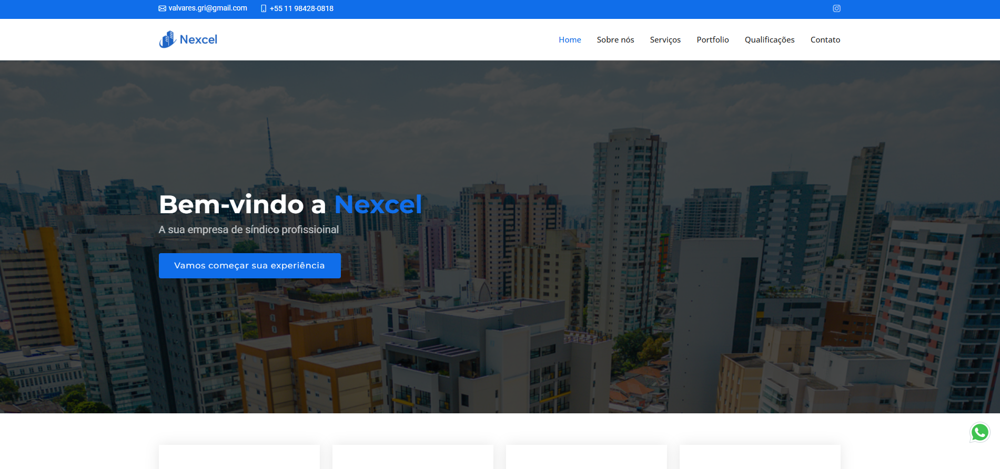

# Nexcel Condominial Services - Institutional Website

 

## 📸 Screenshot

 

## 📄 Project Description

This project involves the development of the institutional website and visual identity (logo) for Nexcel Condominial Services. The goal was to create a modern, clean, and responsive digital platform to clearly present the company's services, conveying professionalism and trust.

 

## ✨ Features

-   **Homepage:** Main presentation of the company and its key differentiators.
-   **Services Section:** Detailed explanation of the condominium management services provided.
-   **About Section:** Nexcel's history and values.
-   **Contact Form:** A direct channel for requesting quotes.
-   **Fully Responsive Design:** The website adapts perfectly to desktops, tablets, and mobile devices.

 

## 🚀 Technologies Used

- **HTML5**
- **CSS3**
- **JavaScript**
- **Bootstrap 5:** Framework used as a basis to ensure agility and responsiveness in development.
- **PHP:** Native to the Bootstrap template, with only the necessary configurations.

 

## 🔗 Live Site

You can access the live production site here:
**[https://nexcelservicoscondominiais.com.br/](https://nexcelservicoscondominiais.com.br/)**

 

## 👩‍💻 Author

Developed by **Maria Eduarda Rosado**.

